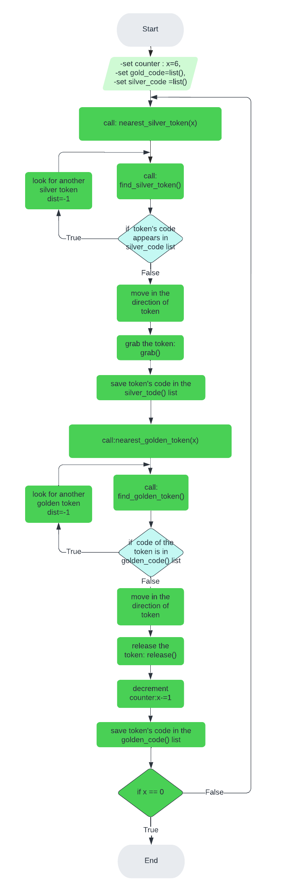

#### Python Robotics Simulator
This is a simple, portable robot simulator developed by Student Robotics. 

-------------------------
#### Description
In this simulation, we are given a mobile robot,6 gold tokens and 6 silver tokens. The aim of the assignment is to make the robot grab a silver token and bring it next to a gold token, then repeat this process for every silver box. 

----------------

#### Installing and running
The simulator requires a Python 2.7 installation, the pygame library, PyPyBox2D, and PyYAML.

Once the dependencies are installed, simply run the test.py script to test out the simulator.

------------------------------------

#### Function

- Nearest_silver_token(x):
the program starts with the robot looking for a silver token.The function calls find_silver_token() which computes and returns the ditstance,the angle and the code of the nearest silver token seen by the robot.If the token was already taken,the robot ignores it and starts another search.
    
        
        while 1:
            
            dist, rot_y ,code= find_silver_token()
            
            if silver_code:
                for i in range(len(silver_code)):
                    if silver_code[i]==code: 
                        dist,rot_y,code=-1,-1,-1   #if token has already been taken, ignore it
                    
If the token isn't in silver_code list,the robot will grab it. At this point the robot starts looking for a gold token.

-  Nearest_golden_token(x):
This function finds gold tokens in the same way of Nearest_silver_token(x) function.
The robot will release the silver token next to the gold token already detected.
This function checks and decrements the counter every time the robot releases a silver token next to a gold one.When the counter equals to 0,the program will end.

        R.release()
			
		gold_code.append(code) # keep track of golden tokens already taken
			
		x-=1   #when robot releases the silver token, counter is decremented 
			
		if x==0:   #the robot brought all silver tokens
			exit()   #end of program 
	
		nearest_silver_token(x) #call function to find a silver token

--------------------
#### FlowChart

------------------------

#### Possible improvements

- Make the robot faster and more efficient.

- Make the robot finds the nearest token around him.

