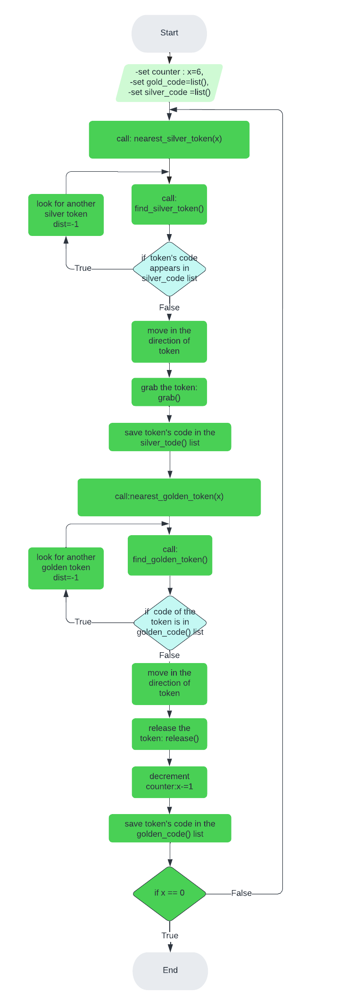

##Python Robotics Simulator
This is a simple, portable robot simulator developed by Student Robotics. Some of the arenas and the exercises have been modified for the Research Track I course

-------------------------

##Installing and running
The simulator requires a Python 2.7 installation, the pygame library, PyPyBox2D, and PyYAML.

Once the dependencies are installed, simply run the test.py script to test out the simulator.

------------------------------------

##Motors
The simulated robot has two motors configured for skid steering, connected to a two-output Motor Board. The left motor is connected to output 0 and the right motor to output 1.

The Motor Board API is identical to that of the SR API, except that motor boards cannot be addressed by serial number. So, to turn on the spot at one quarter of full power, one might write the following:

    R.motors[0].m0.power = 25
    R.motors[0].m1.power = -25

------------------------------

##The Grabber
The robot is equipped with a grabber, capable of picking up a token which is in front of the robot and within 0.4 metres of the robot's centre. To pick up a token, call the R.grab method:

    success = R.grab()
The R.grab function returns True if a token was successfully picked up, or False otherwise. If the robot is already holding a token, it will throw an AlreadyHoldingSomethingException.

To drop the token, call the R.release method.

Cable-tie flails are not implemented.

-------------------------

##Vision
To help the robot find tokens and navigate, each token has markers stuck to it, as does each wall. The R.see method returns a list of all the markers the robot can see, as Marker objects. The robot can only see markers which it is facing towards.

Each Marker object has the following attributes:

info: a MarkerInfo object describing the marker itself. Has the following attributes:
code: the numeric code of the marker.
marker_type: the type of object the marker is attached to (either MARKER_TOKEN_GOLD, MARKER_TOKEN_SILVER or MARKER_ARENA).
offset: offset of the numeric code of the marker from the lowest numbered marker of its type. For example, token number 3 has the code 43, but offset 3.
size: the size that the marker would be in the real game, for compatibility with the SR API.
centre: the location of the marker in polar coordinates, as a PolarCoord object. Has the following attributes:
length: the distance from the centre of the robot to the object (in metres).
rot_y: rotation about the Y axis in degrees.
dist: an alias for centre.length
res: the value of the res parameter of R.see, for compatibility with the SR API.
rot_y: an alias for centre.rot_y
timestamp: the time at which the marker was seen (when R.see was called).
For example, the following code lists all of the markers the robot can see:

--------------------------
##Function

- Nearest_silver_token(x):
the program starts with robot looking for a silver token.The function calls find_silver_token() which computes and returns the ditstance,the angle and the code of the nearest silver token seen by robot.If the token has been already taken the robot ignores it and starts another research.
    
        
        while 1:
            
            dist, rot_y ,code= find_silver_token()
            
            if silver_code:
                for i in range(len(silver_code)):
                    if silver_code[i]==code: 
                        dist,rot_y,code=-1,-1,-1   #if token has already been taken, ignore it
                    
If the token isn't in silver_code list,the robot will grab it. At this point the robot starts looking for a golden token.

-  Nearest_golden_token(x):
This function finds gold tokens in the same way of Nearest_silver_token() function.
The robot will release the silver token next to the gold token already detected.
The function checks and decrements the counter every time the robot releases the silver token next to the gold one.When the counter will be equal to 0,the program will finish.

        R.release()
			
		gold_code.append(code) # keep track of golden tokens already taken
			
		x-=1   #when robot releases the silver token, counter is decremented 
			
		if x==0:   #the robot brought all silver tokens
			exit()   #end of program 
	
		nearest_silver_token(x) #call function to find a silver token

--------------------
##FlowChart

------------------------

##Possible improvements"# RT_assignment1" 
